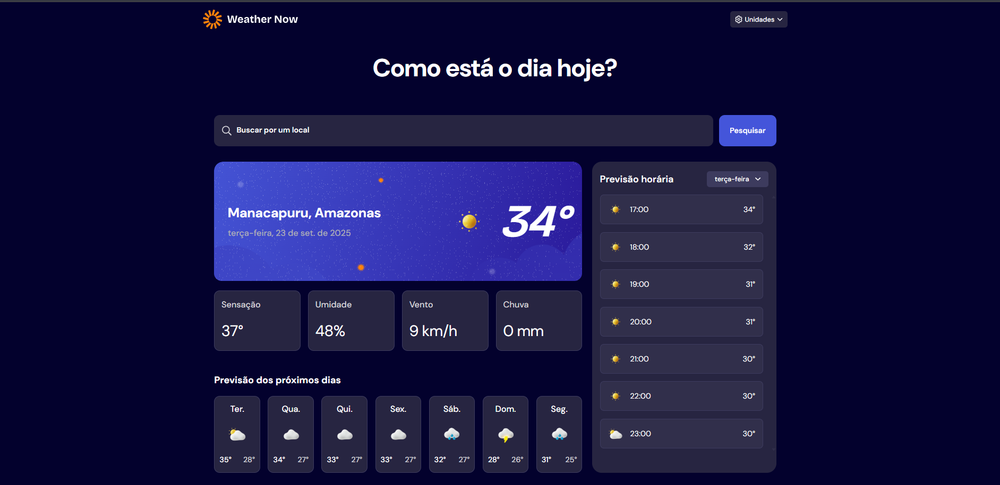

# Frontend Mentor - Solução do Weather App

Este projeto é baseado no [desafio Weather App no Frontend Mentor](https://www.frontendmentor.io/challenges/weather-app-K1FhddVm49). **Adaptei o projeto original (em inglês) para português brasileiro**, incluindo tradução da interface, formatação de datas e localização adequada.

## Sumário

- [Visão geral](#visao-geral)
  - [O desafio](#o-desafio)
  - [Screenshot](#screenshot)
  - [Links](#links)
- [Como usar](#como-usar)
- [Meu processo](#meu-processo)
  - [Construído com](#construido-com)
  - [Funcionalidades implementadas](#funcionalidades-implementadas)
    - [Sistema de Unidades Flexível](#sistema-de-unidades-flexível)
    - [Dados climáticos em tempo real](#dados-climáticos-em-tempo-real)
    - [Design Responsivo](#design-responsivo)
    - [Busca Inteligente](#busca-inteligente)
  - [O que aprendi](#o-que-aprendi)
    - [Arquitetura de Software](#arquitetura-de-software)
    - [Consumo de APIs](#consumo-de-APIs)
  - [Desenvolvimento contínuo](#desenvolvimento-contínuo)
- [Autor](#autor)

## Visão geral

### O desafio

Os usuários devem ser capazes de:

- Pesquisar informações climáticas digitando uma localização na barra de pesquisa

- Visualizar as condições climáticas atuais, incluindo temperatura, ícone de clima e detalhes da localização

- Ver métricas adicionais como temperatura de sensação térmica, porcentagem de umidade, velocidade do vento e quantidade de precipitação

- Navegar por uma previsão de 7 dias com temperaturas máximas/mínimas diárias e ícones de clima
- Visualizar uma previsão horária mostrando mudanças de temperatura ao longo do dia

- Alternar entre os dias da semana usando o seletor de dias na seção de previsão horária

- Alternar entre unidades de medida Imperial e Métrica pelo seletor de unidades

- Alternar entre unidades específicas de temperatura (Celsius e Fahrenheit), velocidade do vento (km/h e mph) e precipitação (milímetros) pelo seletor de unidades

- Visualizar o layout ideal para a interface dependendo do tamanho da tela do dispositivo

- Ver estados de hover e foco em todos os elementos interativos da página

### Screenshot



### Links

- Site online (deploy): [Acessar site](https://weather-app-six-olive-86.vercel.app/)

## Como usar

1. Acesse o site: [weather-app](https://weather-app-six-olive-86.vercel.app/)
2. Digite o nome de uma cidade na barra de pesquisa
3. Pressione Enter ou clique no ícone de busca
4. Visualize as informações climáticas atualizadas
5. Use o seletor de unidades para alternar entre métrico e imperial

## Meu processo

### Construído com

- **Frontend:** HTML5 semântico, CSS3, JavaScript ES6+
- **Layout:** Flexbox, CSS Grid, Mobile-first
- **APIs:** Open-Meteo (clima e geocoding)
- **Arquitetura:** Padrão MVC
- **Deploy:** Vercel
- **Ferramentas:** Git, GitHub

### Funcionalidades implementadas

#### Dados climáticos em tempo real

- Integração com API Open-Meteo
- Informações atuais: temperatura, umidade, vento, precipitação
- Previsão de 7 dias com temperaturas máximas e mínimas
- Previsão horária detalhada

#### Sistema de Unidades Flexível

- Conversão entre sistemas métrico e imperial
- Temperatura: Celsius ↔ Fahrenheit
- Vento: km/h ↔ mph
- Precipitação: mm ↔ in

#### Design Responsivo

- Layout otimizado para mobile, tablet e desktop
- Grid adaptativo que reorganiza conteúdo conforme o tamanho da tela
- Animações de loading e transições suaves

#### Busca Inteligente

- Geocoding automático com API Open-Meteo
- Tratamento diferenciado de erros (cidade não encontrada, erros de conexão/API)
- Estados de loading durante as requisições

### O que aprendi

Durante este projeto, aprofundei conhecimentos em várias áreas:

#### Arquitetura de Software

- Implementação do padrão **MVC**
- Separação clara de responsabilidades entre classes
- Organização modular do código

```js
// Implementação de classes com responsabilidades
class WeatherApp {
  constructor() {
    this.uiController = new UIController(this);
    this.locationService = new LocationService();
    this.weatherApi = new WeatherAPI();
  }
}
```

#### Consumo de APIs

- Integração com API RESTful
- Tratamento de erros e estados de loading
- Manipulação de dados JSON

```js
async getLocation(location) {
  try {
    const response = await fetch(this.baseURL + params);
    if (!response.ok) throw new Error(`HTTP ${response.status}`);

    const data = await response.json();
    return data.results?.length ? data.results[0] : null;
  } catch (error) {
    throw error;
  }
}
```

### Desenvolvimento contínuo

Áreas para melhorias futuras:

- Geolocalização automática para detectar localização do usuário
- Cache local para armazenar dados e reduzir requisições
- Temas personalizáveis (modo escuro/claro)

## Autor

- Frontend Mentor - [@jamillyferreira](https://www.frontendmentor.io/profile/jamillyferreira)
- LinkedIn - [@jamillyferreira](https://www.linkedin.com/in/jamillyferreira/)
- GitHub - [jamillyferreira](https://github.com/jamillyferreira)
